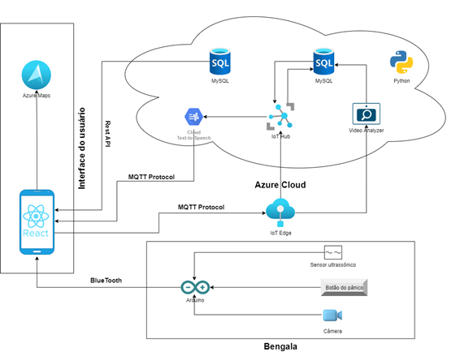
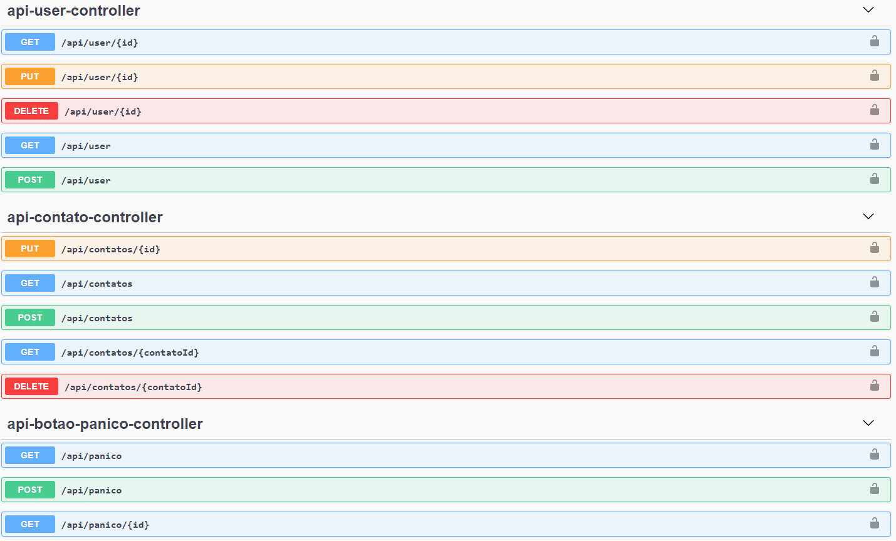

### Grupo QuarenT.I

Integrantes

Alex Yuji Vieira Isomura - RM 84432 

Daniel de Oliveira Sobanski - RM 84281

Denys Lonkovski Maiolli - RM 86487

Edson de Oliveira - RM 84361

Ruan Vieira da Silva - RM 85631

### ESCOPO DO PROJETO

A autonomia de um indivíduo é essencial em seu desenvolvimento pessoal. A dependência a outras pessoas funciona como uma corrente que prende o indivíduo e lhe impossibilita de tomar as suas próprias decisões. Muitos deficientes visuais sentem essa dificuldade na pele quando buscam sua própria independência, seja por meio da leitura de livros ou por meio de uma caminhada na rua. Quando se fala sobre caminhar na rua, as calçadas esburacadas, os obstáculos que ficam na altura da cabeça (como árvores e placas), a falta de semáforos de pedestre especiais com toque sonoro, o perigo de não saber onde está a faixa de pedestres, se tornam um desafio constante na vida diária de um deficiente visual.  Muitos ficam presos a alguém para ajudá-los a sair para a rua sem o perigo de sofrerem acidentes.

Com isso em mente, foi idealizado um projeto que permitirá uma autonomia maior aos deficientes visuais, seja para irem ao trabalho sozinho ou para aproveitarem o dia com mais segurança e tranquilidade nas ruas das cidades. Portanto, foi pensado em alguns objetivos principais que deverão ser atendidos: aumentar a qualidade de vida dos deficientes visuais, promover o bem-estar social desse grupo de pessoas e promover sua autonomia pessoal com mais segurança e tranquilidade.

Para cumprir com esses objetivos, o projeto consistirá em um aplicativo mobile e uma bengala. Na bengala serão incorporados sensores ultrassônicos para identificar obstáculos acima da linha da cintura; câmeras que reconhecerão semáforos de pedestre e faixas de pedestre; e um botão de pânico, caso o deficiente se sinta ameaçado ou sofra algum acidente. Já no aplicativo, as funcionalidades serão um mapa onde o deficiente irá indicar o destino e um áudio irá dizer qual rota seguir; terá o cadastro das pessoas da lista de contatos do deficiente que poderá indicar alguém para receber o alerta do botão de pânico caso ocorra algum acidente ou assalto; e o aplicativo irá receber todas as informações dos sensores e câmeras acopladas na bengala e transmitirá ao deficiente as informações coletadas.

Os stakeholders presentes no projeto serão a FIAP – patrocinadora do projeto; o professor Renato Parducci que fará a coordenação referente à gestão, planejamento e acompanhamento do projeto; o professor Hellynson Lana e Thiago Yamamoto, que serão o scrum master, comunicadores e orientadores de entregas junto à Plusoft; os demais professores do curso de Análise e Desenvolvimento de Sistemas que orientarão os alunos nas suas respectivas matérias; os desenvolvedores da plataforma, que serão os integrantes do grupo de criação; a empresa Plusoft, sendo ela a principal avaliadora do projeto em questão e, por fim, as pessoas com deficiência visual, as principais beneficiárias do projeto.

A entrega do projeto será realizada pelo grupo competente composto por cinco integrantes. A ideia é entregar as funcionalidades por partes durante o período de desenvolvimento do projeto. Para exemplificar como isso será feito, segue as entregas em ordem cronológica: primeiro, será realizado o teste com o sensor ultrassônico, onde será validado sua eficácia em detectar objetos próximos. Após isso, será testada a câmera com as imagens que ela deverá reconhecer, como as faixas e os semáforos de pedestre. Quanto ao GPS, ele deverá ser integrado ao Google Maps e testado nas ruas das cidades. Com todos os dispositivos funcionando, eles terão que ser integrados à nuvem, por meio do Azure da Microsoft, e após isso verificar se o que é informado no aplicativo, é aquilo que realmente deveria estar sendo informado. Tudo em perfeitas condições de funcionamento e em sintonia com aquilo que foi definido neste projeto, o produto final será entregue e estará pronto para uso.

Em cada um dos entregáveis, a ideia é dar um prazo para que todos os avaliadores do produto possam analisar seu funcionamento e indicar aquilo que deve ser alterado. Caso se solicite alguma alteração, os desenvolvedores irão realizá-la e, assim, enviar novamente para a análise dos avaliadores. Caso não se sugira mudanças, os desenvolvedores passarão para o próximo entregável do projeto. Será assim até o prazo final de entrega e com o produto pronto ou até não haver mais sugestões fornecidas pelos avaliadores, antecipando, assim, o prazo final de entrega.

É importante ressaltar que o produto não anula todos os riscos que se tem ao caminhar nas ruas e não substitui a visão de forma completa. Ainda existem muitas armadilhas nas ruas das cidades como: calçadas esburacadas, bueiros abertos, obras que invadem o espaço de pedestres etc. É por isso que o uso da bengala e a experiência e habilidade do deficiente visual ainda se faz necessário, ainda que de forma mais reduzida. O produto visa aumentar a segurança e a tranquilidade, no entanto, não anula todos os problemas que aparecem nas calçadas das cidades.

O produto só será aceito pelo seu público-alvo se cumprir com algumas normas de aceitação. A bengala deverá ser simples, assim como o aplicativo, leve e de fácil utilização, porque o objetivo é facilitar a vida dos deficientes visuais, e não trazer distúrbios ou problemas a eles. O aplicativo deverá estar sempre disponível e conectado com a internet sempre que for utilizado, garantindo que as informações cheguem ao deficiente visual em tempo real e sem falhas no seu comportamento. E, por fim, o cadastramento da pessoa que receberá o alerta do botão de pânico deverá ser fácil e flexível, caso o deficiente visual queira mudar de pessoa.

A premissa que move a criação desse projeto é a clara falta de segurança para os deficientes visuais caminharem em liberdade pelas ruas das cidades. Também foi discutido a falta de autonomia dessas pessoas ao desejarem realizar alguma atividade com independência, e, também, o medo que sentem ao saberem que caminharão sozinhos na cidade, com o perigo de sofrerem acidentes e se lesionarem.

Este projeto possui algumas restrições como: sua equipe de desenvolvedores não pode ultrapassar o limite máximo de cinco pessoas, o projeto deverá ser entregue respeitando o prazo final de entrega e deverá respeitar os órgãos de validação e as normas e regras do país em que está inserido.

Os riscos que este projeto pode sofrer durante sua execução são: A perda de integrantes da equipe, o tempo para conclusão que pode ser alterado, a falta de competência dos integrantes da equipe que pode levar a inúmeros retrabalhos e a má aceitação do produto pelos avaliadores competentes.

### ARQUITETURA DA SOLUÇÃO

  A arquitetura da solução envolve algumas tecnologias que garantirão a perfeita integração entre os componentes e sua alta taxa de disponibilidade para o usuário final, evitando, assim, transtornos com dificuldades de conexão e acesso. Segue abaixo o diagrama de arquitetura: 

Na bengala, o sensor, a câmera e o botão de pânico estarão integrados junto ao Arduino. Este será o hardware principal da solução, onde todas as informações serão coletadas. Com os dados sendo coletados, eles serão encaminhados ao aplicativo via Bluetooth, onde serão recebidos. A partir daí, todos os dados passarão a ser encaminhados para a nuvem por meio do protocolo MQTT, aonde o IoT Edge da Azure irá distribui-los. Há dois caminhos possíveis: o serviço de Video Analyzer da Azure, onde irá analisar a presença de faixas e semáforos de pedestre e se ele se encontra aberto ou fechado. Importante ressaltar que esse serviço suporta apenas as linguagens C# e Python, portanto a linguagem Python será utilizada; e o serviço de IoT Hub, também da Azure, onde irá tratar os dados de distância identificados pelo sensor ultrassônico para transformar esses dados em medidas de centímetros, visto que o Arduíno tem sua própria escala de distância quando recebe os dados do sensor. Com as informações já tratadas e reconhecíveis pelos humanos, elas serão guardadas no banco de dados MySQL da Azure. Com isso, o IoT Hub poderá consultar esses dados do banco e enviá-los ao text-to-speech para que o deficiente visual possa ouvir o conteúdo desses dados. Dessa forma, a aplicação, desenvolvida com React-Native, irá receber todas essas informações via protocolo MQTT. O Azure Maps será utilizado para fornecer todas as informações aos usuários a respeito das rotas que ele deve realizar. O outro banco de dados ficará responsável por armazenar os dados dos usuários cadastrados no sistema e será acessado por meio de uma API Rest.

### TABELA DOS ENDPOINTS

### DESCRIÇÃO DAS FUNCIONALIDADES

##### USER

Será responsável por fazer a parte de inclusão, busca, alteração e exclusão dos usuários da bengala.

##### CONTATO

Será responsável por fazer a parte de inclusão, busca, alteração e exclusão dos contatos do usuário da bengala. Tem um relacionamento muitos para um com usuário.

##### BOTÃO DO PÂNICO

Será responsável por fazer a parte de inclusão da hora do clique do usuário no botão. Tem um relacionamento muitos para um com usuário.
